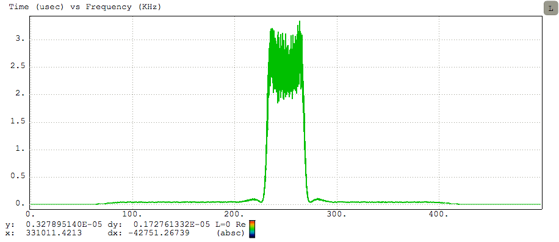

SigPlot
=======

SigPlot provides fast, interactive plotting for software defined radio
applications using HTML5.



Getting Started
=============
First include the SigPlot library in your webpage:

```html
<script src="sigplot-minimized.js" type="text/javascript"></script>
```

Then create a 'div' element to hold your plot:

```html    
<div id="plot"></div>
```

The size and position of the plot are controlled by regular CSS positioning
of the 'div' element.  For example:

```css
#plot {
        height: 400px;
        width: 600px;
}
```

Finally, invoke SigPlot:

```javascript
plot = new sigplot.Plot(document.getElementById('plot'), {autohide_panbars: true});
```

Additional [examples and demos](http://demo.axiosengineering.com/sigplot/) are
available along with [API](http://TODO) documentation. 

Building
=============

Using Grunt
-------------
[Grunt](http://gruntjs.com) is the primary mechanism for building SigPlot.  You
will need an installation of Node.js and the Grunt command line interface.

The first step is to install the build dependencies using `npm install`.

Run `grunt test` to run the unittests and JavaScript linting; run `grunt dist`
to build a distributable version of the project.

If you get an warning from jsbeautifer about files not being "beautified", you 
can use --force while doing development but prior to making your final commits
you should run `grunt jsbeautifier:cleanup`.  This will fix any of the formatting
issues.  It was an intentional decision to not automatically run cleanup because
it can be risky to make changes to the code as part of the build (even if the
beautifier is supposed to be 100% code-identical).

Using Make
-------------
Although Grunt is the canonical build system, a basic Makefile is provided for
environment where Grunt cannot be used.  You will need the following:

* GNU Make
* Java version 1.7+

If you wish to build the SigPlot API documention, you will need
[jsdoc](https://github.com/jsdoc3/jsdoc) installed.

Testing
=============

The non-interactive unittests are executed automatically whenever a Grunt build
is executed.  The full unittest suite is interactive and requires that you
execute tests within a webbrowser.  A local web server can easily be started by
running `npm web_server` and then opening a browser to
http://localhost:1337/test/test.html


Contributing
=====================
The `master` branch is used to distribute stable releases.  No development
should occur directly on the master branch.  To be compatible with Bower, the
output of `grunt dist` (i.e. the files in the `dist` folder) should be commited
when preparing a release.

The `develop` branch should be used for general development towards the next
release.  All code should be built using `grunt jsbeautifier:cleanup`
**before** being commited.  Unlike the `master` branch, the output of the dist
folder should not be commited on the develop branch.

If release candidate builds are desired, a branch should be made from the
`develop` branch.  The package.json and bower.json files should be updated; the
code built with `grunt dist` and the resulting distribution files in the `dist`
folder committed.

Work performed under contract should always be first commited to a topic branch
before being merged into the `develop` branch.

License
=====================
Licensed to the LGS Innovations (LGS) under one
or more contributor license agreements.  See the NOTICE file
distributed with this work for additional information
regarding copyright ownership.  LGS licenses this file
to you under the Apache License, Version 2.0 (the
"License"); you may not use this file except in compliance
with the License.  You may obtain a copy of the License at
 
  http://www.apache.org/licenses/LICENSE-2.0
 
Unless required by applicable law or agreed to in writing,
software distributed under the License is distributed on an
"AS IS" BASIS, WITHOUT WARRANTIES OR CONDITIONS OF ANY
KIND, either express or implied.  See the License for the
specific language governing permissions and limitations
under the License.
